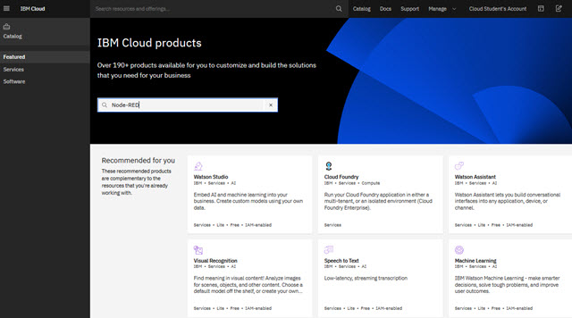

# 🥵Exercise 3

#### Estimated time

xx:xx

## Overview

In this exercise, students....

## Objectives

After completing this exercise, you should be able to: 

* Select ....
* Identify ..
* Explain

## Introduction

In this exercise, students....

## Requirements

This exercise requires:

* Paper and pen.
* ....

Exercise instructions 

In this exercise, you complete the following tasks:

* [ ] Task 1
* [ ] Task 2
* [ ] Task 3

## _Part 1: Title_

Write the intro to this part

Complete the following tasks:

* [ ] Task 1 ... as shown in the following figure.



* [ ] Task 2
* [ ] Task 3

This is an example of an ordered list:

1. Item 1.
2. Item 2.
3. Item 3.

Run the following command:

```text
cd c:\AAAAAA\Git\
Git
```

Your output is similar to the following list:

> `Volume in drive C is Windows-SSD   
> Volume Serial Number is C2A6-1E46  
> Directory of c:\AAAAAA\Git  
> 05/27/2020 12:52 PM  .  
> 05/27/2020 12:52 PM  ..  
> 05/30/2020 04:44 PM  GitBook  
> 05/29/2020 08:15 PM  IoT-ExercisesGuide  
> 05/30/2020 12:21 PM  IoT-Word  
> 05/25/2020 07:50 PM  Markdown 0 File(s) 0 bytes  
> 6 Dir(s) 445,421,899,776 bytes free`


## _Part 2: Title_

Write the intro to this part_...._

Complete the following tasks:

* [ ] Open the IBM Cloud dashboard \([https://cloud.ibm.com](https://cloud.ibm.com)\) in a web browser.
* [ ] Task 2
* [ ] Task 3


 📣 **ATTENTION**: This is very dangerous. 


## _Part 3: Title_

Write the intro to this part_...._

Complete the following tasks:

* [ ] Task 1 ... as shown in the following table:T

| Title col 1 | Title col 2 | Title col 3 | Title col4 |
| :--- | :--- | :--- | :--- |
| cell 1 | cell 2 | cell 3 | cell 4 |
| cell 1 | cell 2 | cell 3 | cell 4 |

* [ ] Task 2
* [ ] Task 3


\*\*\*\*👨🔬 **TROUBLESHOOTING**: Try this approach....


## _Part 4: Title_

Write the intro to this part_...._

Complete the following tasks:

* [ ] Task 1
* [ ] Task 2
* [ ] Task 3

## Exercise review and wrap-up 

This exercise .....

